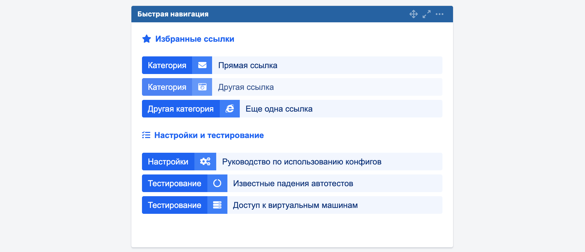

# Упрощенная навигация в Jira

### Что это?

Код из этого репозитория позволяет использовать виджет со ссылками в Jira, который выглядит вот так:



### Установка

**Предполагается, что к этому моменту у нас есть настроенная Jira и хотя бы один рабочий стол.**

1. Открываем рабочий стол в Jira
1. Нажимаем кнопку "Добавить гаджет"
1. Выбираем тип "Текст" (может потребоваться нажать перед этим кнопку "загрузить все гаджеты")
1. Копируем/вставляем (редактируем под себя) код из `docs/example.html`
1. PROFIT

### Настройка

На данный момент настройка выполняется посредством изменения исходного кода прямо в html.

В будущем планируется добавить конструктор для быстрого и удобного изменения списков на лету.

Пример кода блока:

```html
<div class="block">
    <div class="block-header"><i class="fas fa-star"></i> Избранные ссылки</div>
    <div class="block-list">
        <a class="block-link" target="_blank" href="">
            <div class="block-link__category">Категория</div>
            <div class="block-link__icon"><i class="fas fa-info"></i></div>
            <div class="block-link__title">Название</div>
        </a>
        <a class="block-link" target="_blank" href="">
            <div class="block-link__category">Категория</div>
            <div class="block-link__icon"><i class="fas fa-info"></i></div>
            <div class="block-link__title">Название</div>
        </a>
    </div>
</div>
```

Немного особенностей верстки:
* Контейнер с классом `block` отвечает за смысловой блок с заголовком и ссылками
* Контейнер с классом `block-header` отвечает за заголовок блока
* Контейнер с классом `block-list` отвечает за список ссылок
* Контейнер с классом `block-link`отвечает за ссылку

Внутри контейнера `block-link` есть три основных элемента:
* `block-link__category` — категория ссылки (отображается слева)
* `block-link__icon` — иконка ссылки (между категорией и названием)
* `block-link__title` — название ссылки

Все иконки лежат в тэгах `i` и настраиваются при помощи атрибута `class` через FontAwesome.

Можно использовать любые иконки из бесплатного набора [с сайта проекта](https://fontawesome.com/icons?d=gallery&m=free).
